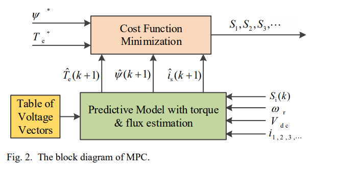

## Enhancing Fault-Tolerant Ability of a Nine-Phase Induction Motor Drive System Using Fuzzy Logic Current Controllers (2017) https://doi.org/10.1109/TEC.2017.2692528

- Fuzzy Logic Rotor Flux Oriented Control (FL-RFOC) algorithm proposed.
- Fuzzy Logic RFOC  ve PI RFOC is compared.
- The controllers based on PR (Proportional Resonent), PI, hysteresis controllers has some drawbacks. These are:
    1) Optimal current values depends on mathematical model. Therefore different faults will result in different current reference values.
    2) There needs to be a transition from pre-fault to faulty condition.
- Short circuit faults are not covered.
- It is stated that "Fuzzy Logic control, one of the robust control methods, has
the ability to adapt to the variation of parameters, and does not
rely on the accurate mathematical model. Indeed, the failure of
stator phase(s) can be considered as the variation of machine
parameters, which can be dealt with automatically by the robustness of the controller __**even without fault detection**__."

<!---
- For zero steady state error, following improvement is made on the FLC.

-->
- Each inverter leg is controlled seperately.

- Comparison of controllers

## A Review of Drive Techniques for Multiphase Machines (2018)  https://doi.org/10.30941/CESTEMS.2018.00030
- Six phase, two three phase groups with neutrals connected.
- Focused on multiphase machine drives rather than fault tolerance
- DTC has been applied to fault tolerant configurations. However, large amounts of space vectors causes computational load, and switching frequency is variable which is not desired in high power applications.
- MPC has faster response than FOC, higher DOF (degrees of freedom) than DTC.
- When there is a fault in MPC, the corresponding Voltage Vector Table is updated.

- Rather than implementing a SVPWM on a multiphase machine, Carried based PWMs  are more preferable.

## Optimal Fault-Tolerant Control of Six-Phase Induction Motor Drives With Parallel Converters (2016) https://doi.org/10.1109/TIE.2015.2461516
- This work explores for the first time the fault-tolerant capability of six-phase induction motor drives supplied from parallel converters connected to a common dc link.
- Fault detection is not covered
- There are different aspects of post fault operation. Obtaining rated torque, minimum loss.
- In this work, currents are optimized for maximum torque.
- An offline optimization is preferred.
- TMS320F28335 is used. (10kHz PWM frequency)

## An Online Global Fault-Tolerant Control Strategy for Symmetrical Multiphase Machines With Minimum Losses in Full Torque Production Range (2020) https://doi.org/10.1109/TPEL.2019.2927382
- Fault detection is not covered.
- Typically optimization process is done offline. There are two limitations to offline optimization.
    1) Lack of generality and extensibility. The offline calculated references can only be applied to machines with the specific phase number an neutral point connection. For a different machine, all the references are needed to be optimized.
    2) Due to the multiphase configuration, the optimized references' lookup tables can be enormous.
- Maximum torque optimization provides torque production range (TPR) with over currents, which creates.
- Minimum loss optimiziation reduces the losses in the expense of reduced TPR.
- An online algorithm is proposed in this paper that uses minimum loss for low torque outputs, when minimum loss TPR is not enough, then maximum torque with minimum loss optimization is used.
- TMS320F28335 is used. (8kHz PWM frequency, 4kHz Control loop frequency)

## Analysis and Control of Current Harmonics in Multiphase Machines in Fault-tolerant Operation against Open-phase Faults (2019) https://doi.org/10.1109/ICEMS.2019.8921512
- Nine-phase induction machine is used.
- For concentrated winding machines, harmonic injection is used.
<!---
- By using virtual winding model, the faulty mode is modeled as a asymmetrical healthy mode.
--->
- Offline optimization is done.
- Tries to minimize the harmonic content of phase current in healthy and faulty conditions.
- TMS320F28335 is used. (4kHz PWM frequency)

<!---
### Three-Level NPC Inverter Fault Diagnosis by the Average Current Park’s Vector Approach (2012) https://doi.org/10.1109/ICElMach.2012.6350140
- Open circuit fault detection algorithm for three level NPC inverter is provided.
--->
 

### Modelling, Fault Detection and Control of Fault Tolerant Permanent Magnet Machine Drives (2015) http://etheses.whiterose.ac.uk/11456/1/Thesis_Bhaskar_Sen.pdf
-  Online fault detection schemes discussed. These can be listed shortly as:
    1) Observing the harmonic content of phase currents
    2) HF injection (following figure is an experimental result for short circuit detection)

    3) Electromagnetic measurement method. (search coil)
    4) Neutral point voltage measurement.
    5) Fundamental frequency analysis. (Examining the negative sequence components)
    6) Estimation based methods. (Estimating equivalent inductance, resistance and back emf, and observing the changes)

- Field weakening method is not mentioned in both online and offline methods.

- Driving machine under faulty conditions can be divided into two major tasks.  
    1) Generation of appropriate reference signals
    2) Tracking the control of the generated current references.
- For generating appropriate current reference signals, a cost function for optimal torque control is utilized. 
- Since the transformations are not valid in a fault condition, in order to track the generated time varying reference signals, proportional resonant controller is proposed for different RPM values. 
- TMS320F28335 is used. (10kHz PWM frequency)

### MODEL PREDICTIVE CONTROL OF FIVE-PHASE PERMANENT MAGNET ASSISTED SYNCHRONOUS RELUCTANCE MOTOR (2018)
- It has stated that the model predictive has not been extensively studied for multiphase machines.
- Optimization is done for MTPA.
- Comparison is done with a benchmark controller and the developed MPC controller.
- Model parameter adaption is done. The resistances are updated depending on the fault and change in temperature.
- TMS320F28335 is used. 

## My inferences from this literature research so far
- Robustness of the Fuzzy Logic Controller could be useful under faulty conditions. 
- Even though MPC has computation cost, it is more advantageous. Various optimizations can be realized.
- Sensorless drive (i.e. speed estimation) could be used in order to obtain a faster response.
- Online fault current optimizations are studied less.
- Generally, the machines are driven at 5-10kHz PWM frequencies with TMS320F28335(150MHz). Our switching frequency is much higher (40kHz) with TMS320F28379(200MHz). 
