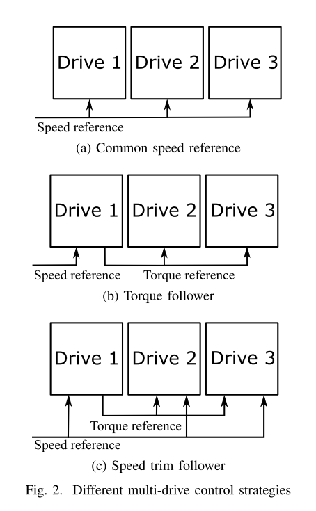

#### A Modular Speed-Drooped System for High Reliability Integrated Modular Motor Drives
#### Authors: Alessandro Galassini, Giampaolo Buticchi, Davide Barater
## Overview
In this paper there are different drive configrations for an IMMD is compared. Then it is proposed that the "common speed reference" method is more suitable for an IMMD (figure below). However since the common speed reference method does not guarantee equal load sharing between the modules, droop control method is proposed here to compansate that.

Normally droop control is used in AC power delivering applications, when multiple generators are required to deliver power to the same load. At low powers, the generators are provided with a lower speed set value. At higher speed their speed set value is increased, but the power still delivered at rated frequency(i.e. 50hz). There is a direct relation between the power output and the speed set value. See the relation of the speed reference (wi) with output frequency (wo) and the power output (Pi). KD is the droop coefficient.  

In this paper droop control is used for relating the speed reference value with the currents of the inverter through the following relation.  

Moving further the details and simplifications about the control algorithm is provided. Experimental results are also provided.

## Important points
 