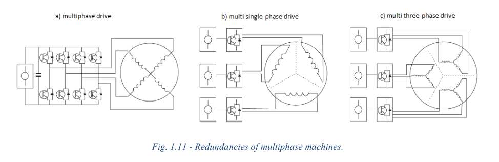
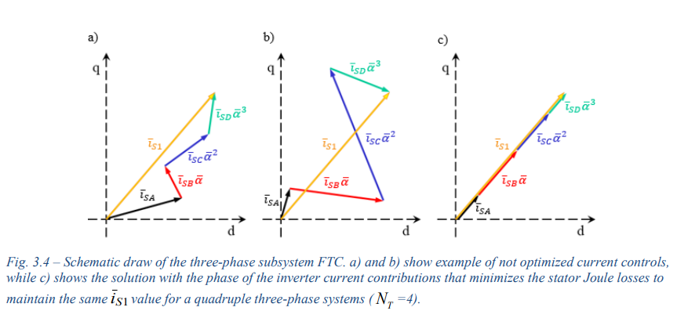
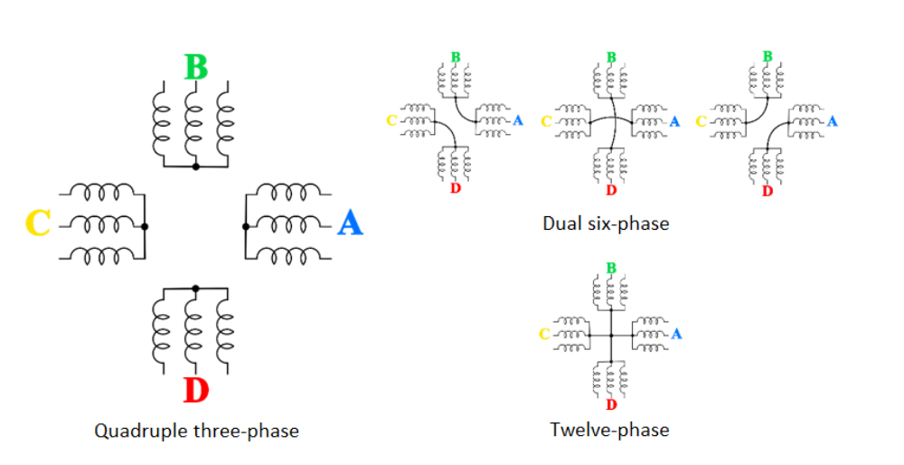
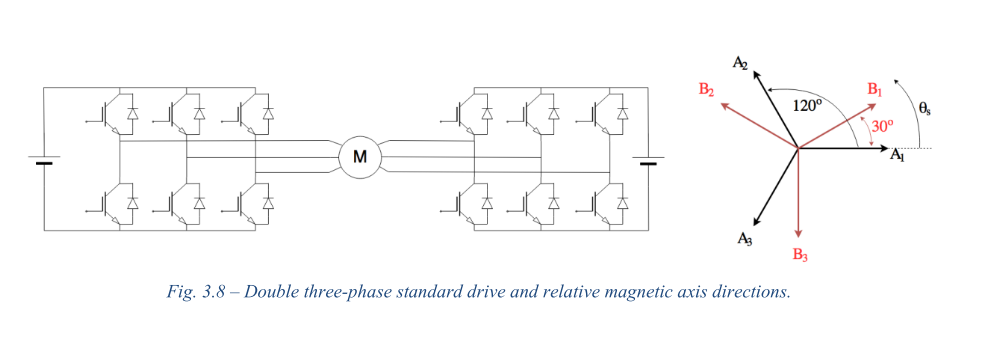
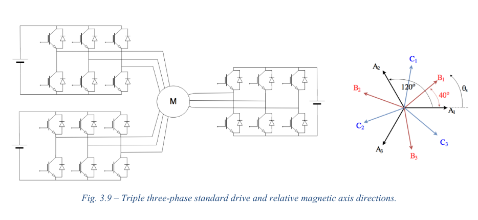
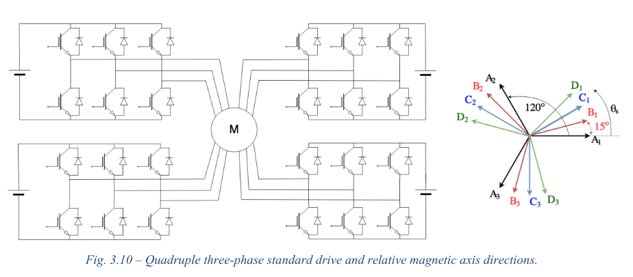
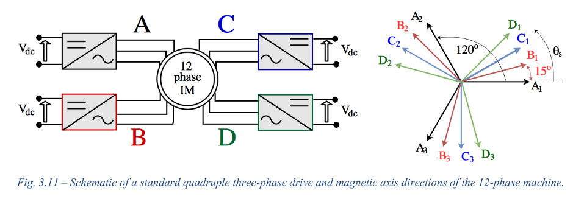
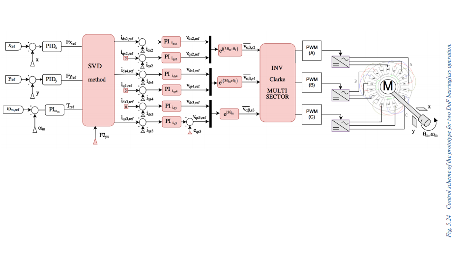

#### MULTIPHASE ELECTRIC DRIVES FOR “MORE ELECTRIC AIRCRAFT” APPLICATIONS
#### Author: Giacomo Sala
## Overview of the chapters:

### - Chapter 1: Multiphase Machines for More Electric Aircraft applications
 He summarizes the motives for using electrical machines more in the aircraft application. Moreover he mentions the reasons for using multiphase machines instead of a conventional three phase machines, it is because of the fact that multiphase machines are instrinsicly fault tolerant. He also provides information about the probability that an fault occuring in an electrical drives. It turns out that the most common fault in an electrical drive is open phase fault. He states that his main focus will be on **multi-three phase** (figure below) drives and their Fault Tolerant Control (FTC).

### - Chapter 2: Multi-Harmonic Generalised Model for Multiphase Machines
The main focus in this chapter was to modeling of the machine. I didn't dive into the details of the equations. Space vector formulations for various types of windings are provided. Some of them can be listed as **quadruple three phase machine** , **nine-phase machine**. Voltage vectors, flux vectors, SPMSM modeling, squirrel cage modeling, Power, Torque and Force Equations are also covered in this chapter.

### - Chapter 3: Open Phase Faults and Fault Tolerant Controls in Multiphase Drives
Fault scenarios on the drive side and the modeling of these faults are provided in this chapter. 
At the beginning a general look at the top and bottom switch open circuit faults are investigated for only motoring mode of operation. He draws attention to the fact that in the case of a switch open circuit fault, since we don't have much control, the corresponding inverter can work as a three phase rectifier and there should be protection against that.  
He presents a mathematical model for a fault tolerant control (FTC). The contribution from each current vector should be in phase in order to minimize the losses, as show in the figure below.

In the model provided here, when a fault occurs on one of the three-phase subsystems, the others are required to compensate its absence by increasing their current references. 

 - The figures below are similar to our case

### - Chapter 3.6: Case study 12-Phase Asymmetrical Machine
In this part of the chapter, simulation results are obtained for the motor with following parameters.

It seems that twelve phase case have better efficiency in case of a fault. Current waveforms of each configuration at different fault conditions is provided.   
Simulation results of voltage waveforms and flux distributions are provided. At the end, the experimental results are shared.

### - Chapter 4: High Resistance and Interturn Short Circuit Faults
 - This chapter provides mathematical model for HR and ISC faults. Also fault detection is covered at section 4.10

### - Chapter 5: Modelling of Multi Three- Phase Sectored Machines for Radial Force Control
It is suggested that due to the non-idealities the drive must be analysed as a multiphase model. Derives the formulas using space vector decomposition approach (SVD) (lost around here). Derives the equations for a triple three-phase sectored machine. Experimental results are also provided.

### - Chapter 6: 

## - Key points taken from this reading
1 - Space vector decomposition can be important, will be investigated.  
2 - Chapter 5 reference [12] will be investigated.  
3 - Various ideas rose in my mind about multi phase control. There are numerous parts that are not clear in my mind. I might revisit this the future.  
4 - Chapter 6 reference [5] and [2] seem interesting  
